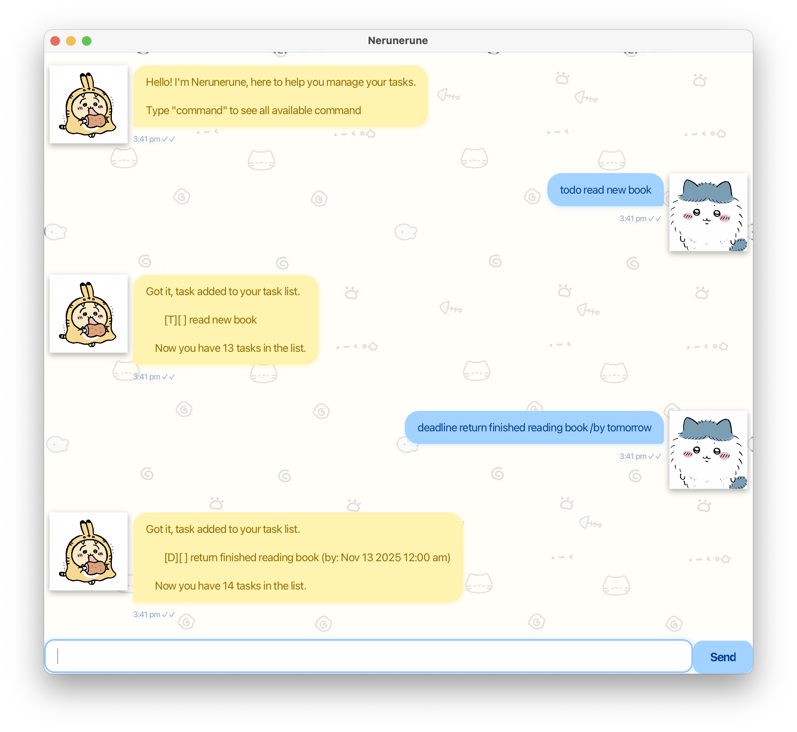

# Nerunerune User Guide

## Product Intro

Nerunerune is a simple task management application that helps you organize deadlines, events, and to-dos efficiently.
The application provides a user-friendly interface to manage your tasks, track deadlines, and schedule events with ease.



## Legend

`[T]` = Todo task<br>
`[D]` = Deadline task<br>
`[E]` = Event task<br>
`[X]` = Task completed<br>
`[ ]` = Task not completed<br>

## Features

### Viewing all Commands

Displays a list of all available commands and their usage

#### Example:

`command`

```
command
```

#### Expected:

```
Nerunerune Commands

list - Show all tasks
find <keyword> - Search tasks
schedule <date> - View tasks for date
...
```

### Add a Todo

Adds a simple task without any date or time

#### Example:

`todo <task description>`

```
todo buy groceries
```

#### Expected:

```
Got it, task added to your task list.
    [T][ ] buy groceries
Now you have 1 tasks in the list.
```

### Add a Deadline

Adds a task with a specific deadline

#### Example:

`deadline <task description> /by <date>`

##### Date options

- Single dates: `today`, `tomorrow`, `yesterday`, `DD-MM-YYYY`
- Date ranges: `next week`, `next month`

```
deadline submit report /by 15-12-2025 1400
```

```
deadline submit report /by next week
```

#### Expected:

```
Got it, task added to your task list.
    [D][ ] submit report (by: Dec 15 2025 2:00 PM)
Now you have 2 tasks in the list.
```

### Add an Event

Adds an event with start and end times

#### Example:

`event <event description> /from <start date> /to <end date>`

```
event team meeting /from 20-12-2025 1400 /to 20-12-2025 1600
```

#### Expected:

```
Got it, task added to your task list.
    [E][ ] team meeting (from: Dec 20 2025 2:00 PM to: Dec 20 2025 4:00 PM)
Now you have 3 tasks in the list.
```

### Listing All Tasks

Displays all tasks in your task list with their status

#### Example:

`list`

```
list
```

#### Expected:

```
Here's what's on your task list so far (3 in total):
    1. [T][ ] buy groceries
    2. [D][ ] submit report (by: Dec 15 2025 2:00 PM)
    3. [E][ ] team meeting (from: Dec 20 2025 2:00 PM to: Dec 20 2025 4:00 PM)
```

### Marking a Task as Done

Mark a task as completed

#### Example:

`mark <task description>`

```
mark buy groceries
```

#### Expected:

```
Alright! "buy groceries" mark as done!
    [T][X] buy groceries
```

#### Special Usage:

`mark backdated` - Marks all overdue deadlines and past events as completed

### Unmarking a Task

Mark a task that is completed as not completed

#### Example:

`unmark <task description>`

```
unmark buy groceries
```

#### Expected:

```
Alright! "buy groceries" unmark.
    [T][ ] buy groceries
```

### Deleting a Task

Removes a task from your task list

#### Example:

`delete <task description or task number>`

```
delete buy groceries
```

```
delete 1
```

#### Expected:

```
Got it, task removed from your task list.
    [T][X] buy groceries
Now you have 2 tasks in the list.
```

#### Special Usage:

`delete all done` - Deletes all completed tasks from the list

### Finding Tasks

Searches for tasks containing a specific or partial keyword (case-sensitive)

#### Example:

`find <keyword>`

```
find report
```

#### Expected:

```
Here are all the matching tasks I can find:
    1. [D][ ] submit report (by: Dec 15 2025 2:00 PM)
```

### Viewing Schedule

Displays all deadlines and events for a specific date or date range

#### Example:

`schedule <date>`

##### Date options

- Single dates: `today`, `tomorrow`, `yesterday`, `DD-MM-YYYY`
- Date ranges: `next week`, `next month`

```
schedule 15-12-2025
```

#### Expected:

```
Schedule for Wednesday, 15 Dec 2025
    Deadlines:
        1. [D][ ] submit report (by: Dec 25 2025 2:00 PM)

Total: 1 tasks
```

## Data Storage

Tasks are automatically saved to your computer after every command. The data file is located at
`./nerunerune/data/tasks.txt`.

**Important Notes:**

- Do not manually edit the data file unless you understand the format
- Corrupted data files will be automatically archived or deleted if archiving fails<br>
  `./neruneurne/data/tasksArchieve.txt`
- The application will create a new data file if the existing one is corrupted

## Troubleshooting

Common Error Messages

### "Details after [command] cannot be empty"

- You forgot to provide task details after the command
- Example fix: Use todo buy milk instead of just todo

### "Invalid date and time detected"

- The date format is incorrect
- Use format: DD-MM-YYYY HHmm (e.g., 25-12-2025 1400)
- Hours must be between 00-23, minutes between 00-59

### "Deadline must contain /by"

- The deadline command is missing the /by keyword
- Correct format: deadline task /by date

### "Event must contain /from and /to in correct order"

- The event command is missing /from or /to keywords, or they are in wrong order
- Correct format: event task /from start /to end

### "Cannot add event. It clash with existing event"

- The event you're adding overlaps with an existing event
- Check your schedule and choose a different time

### "Task with description [name] not found"

- No task matches the description you provided
- Use list to see all tasks and their exact descriptions